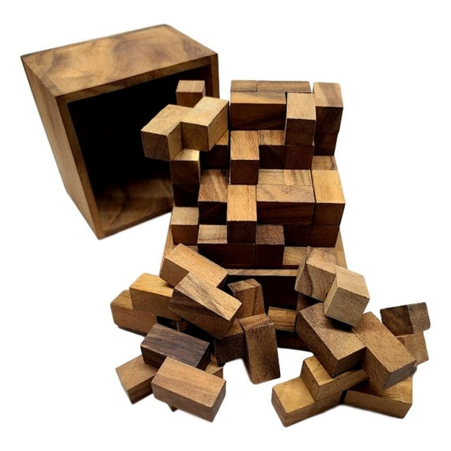
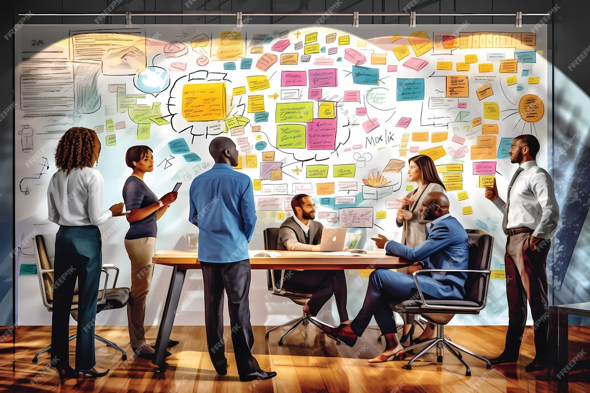
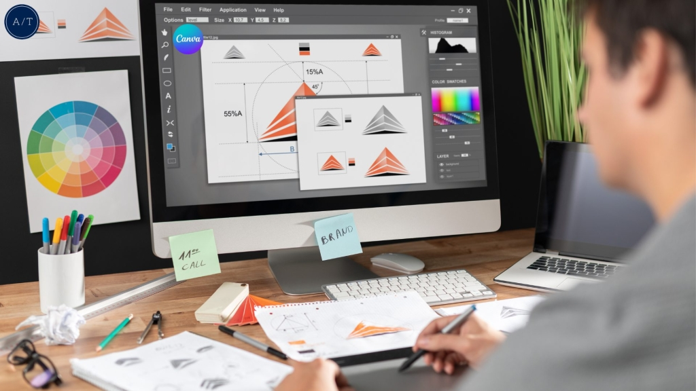
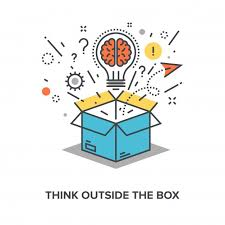

+++
title = '🌐El Arte de Resolver Problemas Digitales1'
date = 2024-11-29T11:26:36+01:00
draft = false
+++

🛠️ *"Cómo la creatividad transforma desafíos tecnológicos en soluciones innovadoras."*  

---

## 🌟 **Una Nueva Forma de Ver los Problemas**  

En la era digital, **los problemas no son barreras; son oportunidades disfrazadas**. 🚀  
La creatividad juega un papel clave al abordar estos desafíos, permitiendo a los innovadores encontrar soluciones únicas donde otros ven obstáculos insuperables. 💡✨  

---

## 🤔 **¿Cómo aplicar la creatividad en la resolución de problemas?**

### 🔄 1. Pensamiento Lateral  
Mira los problemas desde una perspectiva diferente. 👀  
**Ejemplo:** En lugar de mejorar un proceso complejo, ¿podrías eliminarlo completamente?  

---

### 🤝 2. Colaboración Interdisciplinaria  
Junta mentes de distintas áreas para encontrar soluciones más completas. 🌍🧠  
**Ejemplo:** Diseñadores trabajando con programadores pueden crear interfaces más intuitivas y amigables para el usuario.  

---

### ⚡ 3. Prototipado Rápido  
Experimenta con soluciones para identificar las mejores ideas rápidamente. ⏩  
**Ejemplo:** Usa herramientas como **Figma** o **Sketch** para validar conceptos visuales antes de implementarlos.  

---

## 📖 **Casos reales de creatividad en acción**  

- **🎬 Netflix:** Transformó el negocio de alquiler de DVD al anticipar la era del streaming.  
- **🚗 Tesla:** Reinventó el concepto de vehículos eléctricos con tecnología y diseño atractivo.  

---

## 🔑 **Conclusión**  

La próxima vez que enfrentes un desafío digital, recuerda que tienes una herramienta poderosa a tu disposición: **tu creatividad**. 🌟  
No te limites a lo tradicional; piensa fuera de la caja 🧩 y deja que la innovación te guíe.  

