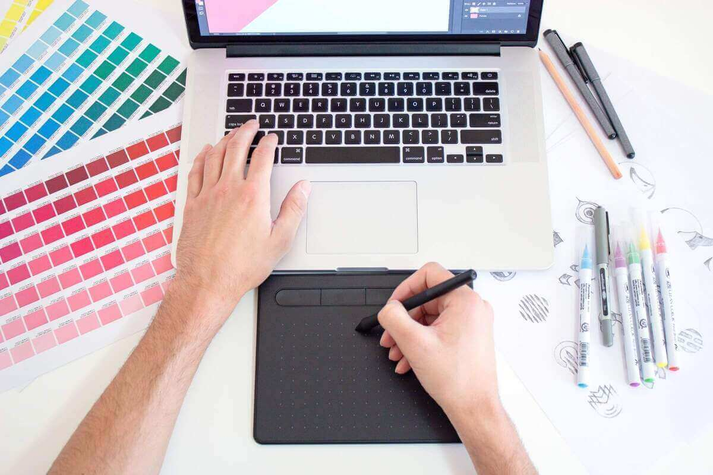

+++
title = "Explorando la Creatividad en el Mundo Digital"
date = 2024-11-29T09:05:07+01:00
draft = false
+++

### ✨ La Magia de Crear en la Era Digital

En un mundo dominado por la tecnología, **la creatividad** 🌈 sigue siendo el alma que da vida a las innovaciones más asombrosas. Desde el diseño gráfico 🎨 hasta el desarrollo de aplicaciones 📱, nunca antes habíamos tenido tantas herramientas a nuestra disposición para convertir ideas 💡 en realidades tangibles.

### 💭 ¿Por qué es importante la creatividad hoy?

La creatividad no solo es arte 🎭; es la capacidad de ver más allá de lo evidente, conectar ideas aparentemente dispares y resolver problemas con enfoques originales. En la era digital, estas habilidades son clave en campos como:

- **💻 Desarrollo de Software:** Crear interfaces intuitivas y atractivas que cautivan al usuario.
- **📢 Marketing Digital:** Contar historias impactantes que conectan emocionalmente con el público.
- **📚 Educación:** Diseñar experiencias interactivas que revolucionan la manera en que aprendemos.

---

### 🛠️ Herramientas que despiertan tu creatividad

Si estás buscando potenciar tus habilidades creativas, aquí tienes algunas herramientas increíbles:

1. **🖌️ Canva**: Ideal para diseño gráfico sin experiencia previa.  
2. **🎨 Procreate**: Una aplicación poderosa para ilustraciones digitales.  
3. **📝 Hugo + Ananke**: ¡Crea blogs y comparte tus ideas con el mundo!  

---

### 🌍 Inspiración desde la cotidianidad

¿Sabías que las mejores ideas a menudo surgen de momentos simples? 🌅 Un paseo por la naturaleza, una conversación inesperada 💬 o incluso una taza de café ☕ pueden ser la chispa que encienda la llama creativa. Aprende a encontrar inspiración en los pequeños detalles y verás cómo tu mundo creativo se expande. ✨

---

### 🎉 ¿Y tú, qué estás creando hoy?

La creatividad es un viaje sin fin. Comparte tus ideas, inspírate en otros y, sobre todo, ¡nunca dejes de explorar! 💡

---

**"El futuro pertenece a quienes creen en la belleza de sus sueños." – Eleanor Roosevelt** 🌟